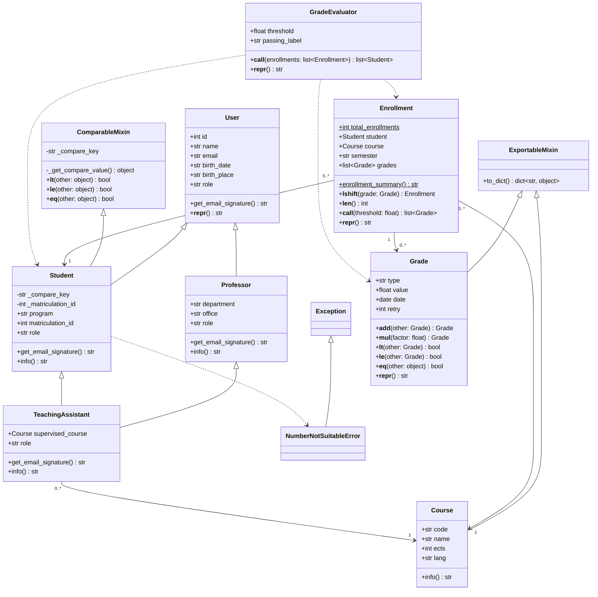

Hier ist unser UML-Klassendiagramm für die Abgabe:

```mermaid
classDiagram
    %% Inheritance (Vererbung)
    User <|-- Professor
    User <|-- Student
    ComparableMixin <|-- Student
    Professor <|-- TeachingAssistant
    Student <|-- TeachingAssistant
    Exception <|-- NumberNotSuitableError
    ExportableMixin <|-- Course
    ExportableMixin <|-- Grade

    %% Associations (Besitz)
    Enrollment "0..*" --> "1" Student
    Enrollment "0..*" --> "1" Course
    Enrollment "1" --> "0..*" Grade
    TeachingAssistant "0..*" --> "1" Course

    %% Dependencies (Abhängigkeiten)
    Student ..> NumberNotSuitableError
    GradeEvaluator ..> Enrollment
    GradeEvaluator ..> Student
    GradeEvaluator ..> Grade

    class User {
        +int id
        +str name
        +str email
        +str birth_date
        +str birth_place
        +str role
        +get_email_signature() str
        +__repr__() str
    }

    class Professor {
        +str department
        +str office
        +str role
        +get_email_signature() str
        +info() str
    }

    class Student {
        -str _compare_key
        -int _matriculation_id
        +str program
        +int matriculation_id
        +str role
        +get_email_signature() str
        +info() str
    }

    class TeachingAssistant {
        +Course supervised_course
        +str role
        +get_email_signature() str
        +info() str
    }

    class ComparableMixin {
        -str _compare_key
        -_get_compare_value() object
        +__lt__(other: object) bool
        +__le__(other: object) bool
        +__eq__(other: object) bool
    }

    class Exception {
    }

    class NumberNotSuitableError {
    }

    class Enrollment {
        +int total_enrollments$
        +Student student
        +Course course
        +str semester
        +list~Grade~ grades
        +enrollment_summary()$ str
        +__lshift__(grade: Grade) Enrollment
        +__len__() int
        +__call__(threshold: float) list~Grade~
        +__repr__() str
    }

    class Course {
        +str code
        +str name
        +int ects
        +str lang
        +info() str
    }

    class ExportableMixin {
        +to_dict() dict~str, object~
    }

    class Grade {
        +str type
        +float value
        +date date
        +int retry
        +__add__(other: Grade) Grade
        +__mul__(factor: float) Grade
        +__lt__(other: Grade) bool
        +__le__(other: Grade) bool
        +__eq__(other: object) bool
        +__repr__() str
    }

    class GradeEvaluator {
        +float threshold
        +str passing_label
        +__call__(enrollments: list~Enrollment~) list~Student~
        +__repr__() str
    }
```
